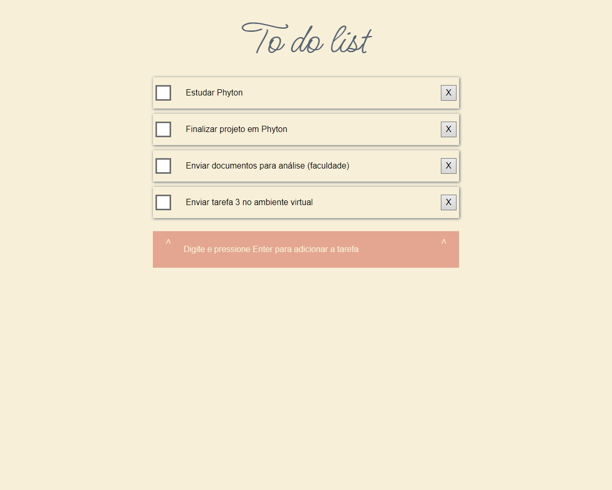

# TO DO LIST

Projeto realizado baseado no vídeo do Youtube do Fernando Leonid.

Project based on Fernando Leonid Youtube's Channel.

# Tecnologias

- HTML
- CSS
- Javascript
- GIT e GITHUB

Neste projeto foi possível treinar lógica de programação, manipulação de DOM, eventos, callback, estrutura de dados e cache com local storage.

In this project I could practice logic programming, arrays, DOM Manipulation, events, callback, data structure and handling cache with local storage.